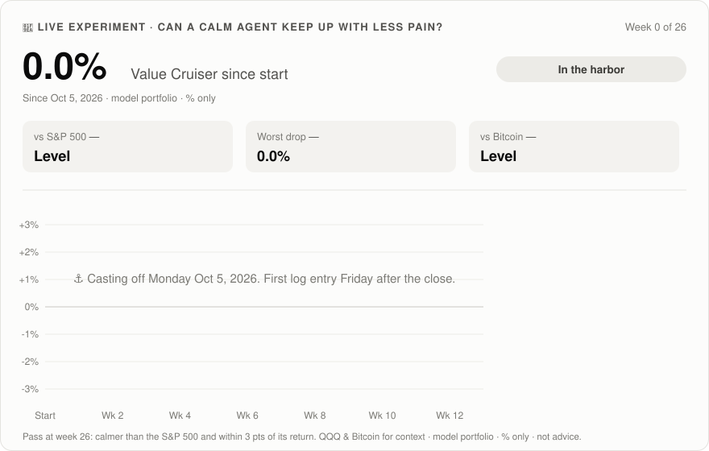

# 🛳️ VALUE CRUISER: a calm two-part investing agent

### *Claude Cowork 🤝 Interactive Brokers · ⚓ The core does the cruising, 💎 the value sleeve hunts for bargains.*

**Value Cruiser** 🤖 watches your long-term portfolio every evening, tells you when it drifts off course, drafts the 🧮 rebalance, screens for 💎 cheap quality stocks every Monday, and sends you a 📬 calm email.
**You place every trade yourself.** The agent never trades. 🔒

## 🔴 Live: does it actually work?

A **model portfolio** has followed exactly these rules since **Oct 5, 2026**. The scoreboard updates every Friday after the close, **% only**.



<!-- CAPTAINS-LOG:START -->
### 🧭 Captain's Log
*Casting off Monday Oct 5. First log entry arrives Friday Oct 9 after the close.*
<!-- CAPTAINS-LOG:END -->

**[📒 Full captain's log →](LIVE.md)** · 🧪 Pass/fail at week 26: a smaller worst drop than the S&P 500, and within 3 points of its return. QQQ and Bitcoin are shown for context.

> 🧭 **Long-term money, not a trading sandbox.** About 4–10 trades a year. Want action? Meet the fast sibling, [🏎️ Twin Turbo](https://github.com/OmarTokens/twin-turbo-trader).
>
> ⚠️ **Not financial advice.** You can lose money (the backtest below fell −13% at its worst, and real markets can do much worse). Read the [fine print](#️-the-fine-print).

---

## 🧠 Why two parts?

We tested the fancy stuff (trend filters, dip rules, tilting toward last year's winner) and **none of it beat a plain, rebalanced mix** on a fair test. So the core stays boring, and the fun goes in a small, capped sleeve:

| Part | Share | What it does | Pace |
|---|---|---|---|
| ⚓ **CORE** | **90%** | Five funds at fixed weights: US stocks, international stocks, gold, T-bills, AAA loans. Rebalanced when something drifts. | ~1–2 trades/quarter |
| 💎 **VALUE SLEEVE** | **10%** | Up to 5 quality companies trading **cheap vs their own history**, reviewed monthly | ~1 trade/month |

**Together: a calmer ride than the S&P 500**, all from rules, no vibes. 🎯

---

## ⚡ Launch sequence (about 15 min)

| Step | Do this |
|---|---|
| 1️⃣ 🔌 | **Connect** in Claude (Settings → Connectors): **Interactive Brokers** (required, for prices; your money can sit at any broker) and **Gmail** (for the email; optional) |
| 2️⃣ 🗂️ | **Create a Cowork project.** Name it after your agent. |
| 3️⃣ 📋 | **Paste this** into a new session: *"Set me up from this guide: https://github.com/OmarTokens/value-cruiser. Ask me the 3 questions, save the engine and my config to the project, then do a dry run with a sample email. No trades."* |
| 4️⃣ ⏰ | **Say "schedule it."** It runs weekdays at **~4:30 pm ET** (after the close) and Mondays at **~10:15 am ET** (value screen). Turn on **"Automatically approve"** in the scheduled task's settings if it's offered. |
| 5️⃣ ☕ | **When an email says "course correction":** read the plan, place the orders yourself at your broker, then tell the agent what filled. |

> 💡 **Use your tax-advantaged accounts.** The agent does its selling inside IRAs and Roths first, so most rebalancing never creates a tax bill.

---

## 🎯 Just 3 questions

### 1 · 💰 How much, and where?
Each account's value and whether it's **taxable** (a normal brokerage account) or **tax-advantaged** (IRA, Roth, 401k). Type it in or paste a screenshot of your positions (**crop out account numbers**).

### 2 · 🎚️ Which mix?

| | 🛳️ **Value Cruiser** *(default)* | ⚓ **Core Only** |
|---|---|---|
| Mix | 90% core / 10% value sleeve | 100% core, no stock picking |
| Trades/year | ~10 | ~4 |
| Backtest return (Aug 2022 → Oct 2026)* | +82% | +80% |
| Worst drop* | −12.8% | −12.4% |
| For you if… | You like hunting for bargains with a small slice | You want zero opinions, just the bands |

<sub>*The value sleeve can't be backtested, so it was modelled as extra US stocks. See [the evidence](#-the-evidence-and-its-limits).</sub>

### 3 · 🎤 Email vibe?
🧭 Ship's captain · 📈 Wall St veteran · 🧘 Zen monk · 🏄 Chill surfer · 🧊 Plain · ✍️ *invent your own*

---

## ⚓ Core: the rules

| Rule | Setting |
|---|---|
| 🇺🇸 **US stocks** | **36%** `VTI` (the whole US market) |
| 🌍 **International stocks** | **27%** `VXUS` (everything outside the US) |
| 🥇 **Gold** | **9%** `GLDM` |
| 💵 **T-bills** | **9%** `SGOV` (0–3 month US Treasury bills; almost never moves) |
| 🏦 **AAA loans** | **9%** `JAAA` (only the safest, AAA-rated slices of bundled business loans; floating rate) |
| 📏 **Drift bands** | Big parts **±5 points** (US 31–41%). Small parts **±25% of target** (gold 6.75–11.25%). |
| 🔔 **Course correction** | A part outside its band → the agent drafts a rebalance |
| 🗓️ **Quarterly tune-up** | First trading day of Jan / Apr / Jul / Oct: small fixes only if a part is more than 1% of the portfolio off |
| 💸 **New money** | Goes to the part furthest below target. No selling needed. |
| 🧾 **Taxes** | Sell inside IRAs/Roths first. Any sale in a taxable account gets a flag: check gains, holding period and wash sales, or use new money instead. |

## 💎 Value sleeve: the rules

| Rule | Setting |
|---|---|
| 🎯 **Hunting ground** | The **50-name watchlist** below |
| 📉 **Cheap** | Forward P/E (price ÷ next year's expected earnings) at least **25% below the company's own 5-year median** |
| ✅ **Quality** | Profitable, and earnings estimates haven't fallen more than 10% in 3 months |
| 🧠 **The why** | The reason it's cheap has to look **temporary**. If it looks permanent, it's a value trap. Skip it. |
| 📦 **Size** | Up to **5 names**, starters of ~2% each, max **2.5% per name**, **10%** total |
| 📅 **Earnings** | No new buys within 2 trading days of a report |
| 🚪 **Exit** | Monthly review: the agent flags a name when it's no longer cheap (back above its median) or the "temporary" reason turned permanent. You decide. |

## 🧯 Brakes

- **Never** market timing, leverage, options, shorting, crypto, or changing the targets on its own
- **Stale or missing prices** → no plan that day, and it tells you why

---

## 🗺️ The value watchlist: 50 names

Large, established US companies from across the economy. This is a **fixed list**, so the screen can't chase whatever is hot this week. 🙃

`AAPL` · `ABT` · `ACN` · `ADBE` · `AMGN` · `AMZN` · `AVGO` · `CAT` · `CI` · `CMCSA` · `COST` · `CRM` · `CSCO` · `DE` · `DHR` · `DIS` · `ELV` · `FDX` · `GOOGL` · `HD` · `HON` · `IBM` · `INTU` · `JNJ` · `KO` · `LLY` · `LOW` · `MA` · `MCD` · `MDT` · `META` · `MRK` · `MSFT` · `NFLX` · `NKE` · `NVDA` · `ORCL` · `PEP` · `PFE` · `PG` · `QCOM` · `SBUX` · `TMO` · `TMUS` · `TXN` · `UNH` · `UNP` · `UPS` · `V` · `VZ`

✂️ **Make your own call:** remove anything you don't want to own. Keep it **40+ names**.

---

## 📬 The Captain's Log

**Sample 🧭 (Ship's captain):**
> **Subject: 🛳️ Value Cruiser — Tue Oct 6 — 1 course correction**
>
> Steady seas, Captain. One instrument is outside its band.
>
> 🥇 **GOLD** is at 12.0% vs a 9.0% target (band ±2.25). Strong run.
> 🔴 **SELL — GLDM** · IRA · `≈12 sh` · no tax inside the IRA
> 🟢 **BUY — VXUS** · IRA · `17 sh` · international is furthest below target
>
> ⚓ **Mix:** US 36.9 · Intl 25.0 · Gold 12.0 · T-bills 9.8 · AAA 9.9 · Value 4.7 (room for 2 starters)
> 💎 **On the radar:** ABC (P/E 31% below its median), DEF (27% below; reports in 9 days)
>
> Orders are yours to place. Tell me what filled. — **Value Cruiser** 🛳️
> <sub>Automated output from your own tool, not financial advice. You make every call.</sub>

**Remix anytime:** `email vibe pirate` 🏴‍☠️ · `email shorter` · `email only when action`

---

## 🎛️ Mission control

| If… | Say |
|---|---|
| 👀 You want a quick picture | `status` |
| 📏 Where's the drift? | `drift` |
| 🧮 Draft a rebalance now | `rebalance plan` |
| 💸 New money arrived | `new cash 5000` |
| 💎 Value ideas now | `screen` / `explain <TICKER>` |
| 🧾 You traded | `filled: bought 10 VTI at 378 in IRA` |
| 🎚️ Change the mix | `mix cruiser` · `mix core only` |
| 🏖️ Take a break | `pause` / `resume` |

🏆 **Golden rule:** **don't steer by the news.** The bands do the steering. The most expensive trade in long-term investing is usually the one you make because you were nervous.

---

## 📊 The evidence (and its limits)

**Setup:** daily bars from IBKR, Aug 1 2022 → Oct 2 2026, dividends reinvested, 0.1% cost on every traded dollar, rebalanced to target each quarter.

| Strategy | Total | Per year | Worst drop | Worst 3 months |
|---|---|---|---|---|
| 🛳️ **Value Cruiser** (sleeve modelled as extra VTI) | **+82%** | 15.4% | **−12.8%** | −8.5% |
| ⚓ Core Only | +80% | 15.2% | −12.4% | −7.9% |
| 100% stocks (VTI 60 / VXUS 40) | +90% | 16.7% | −16.3% | −12.8% |
| S&P 500 (SPY) | +98% | 17.8% | −18.8% | −16.4% |
| Nasdaq-100 (QQQ) | +144% | 23.8% | −22.8% | −20.6% |

**By year:**

| | 2022 (Aug–Dec) | 2023 | 2024 | 2025 | 2026 YTD |
|---|---|---|---|---|---|
| 🛳️ Value Cruiser | −2.6% | +18.7% | +15.7% | +22.7% | +10.6% |
| S&P 500 | −6.1% | +26.2% | +24.9% | +17.7% | +13.7% |

**Read this before you decide:** 🧐
- **It trailed the S&P 500 by about 16 points.** In return, its worst drop was about a third smaller and its worst 3 months about half as bad. That trade is the whole point. If you'd rather have the extra return, a plain index fund is simpler.
- It **beat the S&P 500 in only 2 of 5 periods** (the 2022 drop and 2025).
- **Gold did a lot of the work.** GLDM rose +133% in this window. Don't count on that again.
- **The value sleeve is not backtested.** It could help or lag. That's why it's capped at 10% and why the live log tests it.
- **4 years is one market regime,** and a great one for US stocks. In a decade where US stocks lag, the international and gold parts matter more.
- **A backtest is not a forecast.**

---

## 🤖 The agent's rulebook

<details>
<summary><b>Agent: read this section and follow it exactly.</b></summary>

**Setup.** If the project has no `config` doc:
1. Show the Fine Print and ask the user to confirm they've read it.
2. Ask the 3 questions, one at a time. For holdings (typed or a screenshot), record per account: a nickname (never an account number), taxable yes/no, cash, positions. Ask the user to crop out account numbers; never store them.
3. Use IBKR `search_contracts` to find the conid of each core fund and each held stock. Save `config` (agent name, accounts, mix, email vibe, the 50-name watchlist, conids, change history), `holdings` and an empty `journal`.
4. Save the engine and `config.json` below to the project. For **Core Only**, set the VALUE target to 0 (the engine scales the core up by itself).
5. Do a dry run and send a sample email.

When asked to schedule: weekdays ~4:30 pm ET (drift check + Friday logbook on Fridays) and Mondays ~10:15 am ET (value screen; skip it for Core Only). Remind the user about "Automatically approve".

**Each drift check.**
1. If today isn't a US trading day, stop.
2. Prices: `get_price_history` (ONE_DAY, period ONE_WEEK) for every core fund and held stock; use the last completed close. If any price is missing after one retry, **make no plan** and say why.
3. Write `prices.json` and `holdings.json`; run the engine (`--quarterly` on the first trading day of a quarter, `--new-cash X` if the user reported new money).
4. Mode `nothing` → no email (unless the user chose daily). Otherwise email the plan: sells first, then buys, per account, with the engine's reason and every tax flag. Round to whole shares unless the user's broker allows fractions.
5. **Never place orders and never create order instructions** unless the user explicitly turned on `instructions on` (then: LIMIT, DAY, at ±0.3% of the last close).
6. Log the run in `journal`. Holdings change only when the user reports a fill.

**Monday value screen.**
1. Candidates: the 50-name watchlist minus held names minus anything the user removed.
2. For each, find the forward P/E and the 5-year median P/E from at least one dated source. Never invent a number; skip a name if you can't source it.
3. Keep names trading at least 25% below their own median, that are profitable, and whose estimates haven't fallen more than 10% in 3 months.
4. Research the best ~8: latest earnings and guidance, big news, why it's cheap, next earnings date. Rank on "cheap for a reason that looks temporary."
5. Email the top 5 with why / main risk / next earnings date, plus the room left in the sleeve. **No buy unless the sleeve has room and the user decides.**
6. Monthly, re-check each held value name: has the reason it was cheap become permanent? Flag it; never insist.

**Friday logbook.** Week and since-start % for the user's portfolio (deposit-adjusted) vs `SPY`, current mix vs targets, value-sleeve status, anything due next week.

**Guardrails (not negotiable).**
- Research and planning only; the user places every order.
- Long-only funds and stocks: no options, margin, shorting, leveraged/inverse funds, or crypto.
- Follow the engine for the core. Don't time the market or change targets on your own.
- Never call output advice, a recommendation, or a guarantee. Never invent a price, date, holding or source.

<details>
<summary><code>engine.py</code></summary>

```python
"""Value Cruiser engine: drift check + rebalance planner for a calm core + small value sleeve.

Usage:
  python3 engine.py --config config.json --holdings holdings.json --prices prices.json [--new-cash 5000] [--quarterly]

config.json   : {"sleeves": {"US": {"fund": "VTI", "target": 0.36}, "INTL": {"fund": "VXUS", "target": 0.27},
                             "GOLD": {"fund": "GLDM", "target": 0.09}, "TBILLS": {"fund": "SGOV", "target": 0.09},
                             "CLO": {"fund": "JAAA", "target": 0.09}, "VALUE": {"fund": null, "target": 0.10}},
                 "value_max_per_name": 0.025, "min_trade": 100}
holdings.json : {"accounts": [{"name": "IRA", "taxable": false, "cash": 1200.0, "positions": {"VTI": 50, "GLDM": 30}},
                              {"name": "Brokerage", "taxable": true, "cash": 300.0, "positions": {"VXUS": 120, "ADBE": 5}}]}
prices.json   : {"VTI": 377.99, "VXUS": 85.43, ...}   (last close for every ticker held + every core fund)
Any ticker that isn't a core fund counts as the VALUE sleeve.
Prints a JSON plan. Never places orders.
"""
import json, argparse

def band(target):
    # big sleeves: +/-5 points; small sleeves: +/-25% of target
    return 0.05 if target >= 0.20 else target * 0.25

def main():
    ap = argparse.ArgumentParser()
    ap.add_argument('--config'); ap.add_argument('--holdings'); ap.add_argument('--prices')
    ap.add_argument('--new-cash', type=float, default=0.0); ap.add_argument('--quarterly', action='store_true')
    a = ap.parse_args()
    cfg = json.load(open(a.config)); H = json.load(open(a.holdings)); P = json.load(open(a.prices))
    sleeves = cfg['sleeves']; min_trade = cfg.get('min_trade', 100)
    fund2sleeve = {s['fund']: k for k, s in sleeves.items() if s['fund']}
    missing = sorted({t for acc in H['accounts'] for t in acc['positions'] if t not in P} |
                     {s['fund'] for s in sleeves.values() if s['fund'] and s['fund'] not in P})
    if missing:
        print(json.dumps({'error': f'missing prices for {missing} - no plan'})); return

    # ---------- where are we ----------
    val = {k: 0.0 for k in sleeves}; names = {}
    cash = sum(acc['cash'] for acc in H['accounts']) + a.new_cash
    for acc in H['accounts']:
        for t, q in acc['positions'].items():
            v = q * P[t]; s = fund2sleeve.get(t, 'VALUE'); val[s] += v
            if s == 'VALUE': names[t] = names.get(t, 0) + v
    invested = sum(val.values()); total = invested + cash
    # Core targets are scaled to the money NOT in the value sleeve, so unused value room simply stays in the core
    core_sum = sum(s['target'] for s in sleeves.values() if s['fund'])
    vw = val['VALUE'] / total if total else 0
    eff = {k: (s['target'] / core_sum * (1 - vw) if s['fund'] else s['target']) for k, s in sleeves.items()}
    rows = []; broken = []
    for k, s in sleeves.items():
        w = val[k] / total if total else 0; d = w - eff[k]; b = band(s['target'])
        if s['fund']:
            status = 'OK' if abs(d) <= b else ('OVER' if d > 0 else 'UNDER')
            if status != 'OK': broken.append(k)
        else:  # value sleeve is hand-picked: never triggers a rebalance
            status = 'OVER CAP' if w > s['target'] + 0.02 else ('ROOM' if w < s['target'] - b else 'OK')
        rows.append(dict(sleeve=k, fund=s['fund'] or 'stocks', value=round(val[k], 2), weight=round(w * 100, 1),
                         target=round(eff[k] * 100, 1), drift_pts=round(d * 100, 1), band_pts=round(b * 100, 1), status=status))
    plan = {'total': round(total, 2), 'cash': round(cash, 2), 'cash_pct': round(cash / total * 100, 1) if total else 0,
            'sleeves': rows, 'broken': broken, 'sells': [], 'buys': [], 'notes': []}
    cap = cfg.get('value_max_per_name', 0.025)
    for t, v in names.items():
        if v / total > cap: plan['notes'].append(f'{t}: {v/total*100:.1f}% of the portfolio, above the {cap*100:.1f}% per-name cap (flag only)')

    # ---------- what to do ----------
    mode = 'rebalance' if (broken or a.quarterly) else ('new_cash' if cash >= min_trade else 'nothing')
    plan['mode'] = mode
    core = [k for k, s in sleeves.items() if s['fund']]
    gap = {k: eff[k] * total - val[k] for k in core}  # + = needs buying
    if mode == 'nothing':
        plan['notes'].append('All sleeves inside their bands. Nothing to do.')
    if mode == 'rebalance':
        # sells: over-target sleeves, tax-advantaged accounts first, taxable last (flag it)
        accs = sorted(H['accounts'], key=lambda x: x['taxable'])
        status_of = {r['sleeve']: r['status'] for r in rows}
        for k in core:
            need = -gap[k]
            # sell only what is outside its band (or, on the quarterly run, more than 1% of the portfolio off)
            if status_of[k] != 'OVER' and not (a.quarterly and need > 0.01 * total): continue
            if need < min_trade: continue
            f = sleeves[k]['fund']
            for acc in accs:
                q = acc['positions'].get(f, 0)
                if q <= 0 or need < min_trade: continue
                amt = min(q * P[f], need); qty = round(amt / P[f], 3)
                plan['sells'].append(dict(account=acc['name'], symbol=f, qty=qty, approx=round(qty * P[f], 2),
                                          reason=f'{k} over target', tax_flag=bool(acc['taxable'])))
                acc['cash'] += qty * P[f]; need -= qty * P[f]
        # with no sells needed (only UNDER sleeves), new cash and idle cash fill the gaps
    if mode in ('rebalance', 'new_cash'):
        pool = [dict(name=acc['name'], taxable=acc['taxable'], cash=acc['cash']) for acc in H['accounts']]
        if a.new_cash: pool.append(dict(name='NEW CASH (pick the account)', taxable=None, cash=a.new_cash))
        # most underweight first
        for k in sorted(core, key=lambda k: -gap[k] / eff[k]):
            need = gap[k]; f = sleeves[k]['fund']
            for acc in sorted(pool, key=lambda x: (x['taxable'] is not False, -x['cash'])):
                if need < min_trade: break
                spend = min(acc['cash'] - 5, need)
                if spend < min_trade: continue
                qty = int(spend // P[f])  # whole shares; fractional if your broker allows
                if qty < 1: continue
                plan['buys'].append(dict(account=acc['name'], symbol=f, qty=qty, approx=round(qty * P[f], 2), reason=f'{k} under target'))
                acc['cash'] -= qty * P[f]; need -= qty * P[f]
        vgap = sleeves['VALUE']['target'] * total - val['VALUE']
        if vgap > min_trade:
            plan['notes'].append(f'Value sleeve has room for about {vgap:,.0f}. Use the Monday screen; starters of about '
                                 f'{min(vgap, cap*total):,.0f} each. Never auto-filled by the engine.')
    if any(s['tax_flag'] for s in plan['sells']):
        plan['notes'].append('Some sells are in taxable accounts: check gains, holding period and wash-sale timing first, '
                             'or fund the gap with new cash instead.')
    print(json.dumps(plan, indent=1))

if __name__ == '__main__':
    main()
```
</details>

<details>
<summary><code>config.json</code> (Classic defaults)</summary>

```json
{"sleeves": {"US": {"fund": "VTI", "target": 0.36}, "INTL": {"fund": "VXUS", "target": 0.27},
             "GOLD": {"fund": "GLDM", "target": 0.09}, "TBILLS": {"fund": "SGOV", "target": 0.09},
             "CLO": {"fund": "JAAA", "target": 0.09}, "VALUE": {"fund": null, "target": 0.10}},
 "value_max_per_name": 0.025, "min_trade": 100}
```
</details>

</details>

---

## ⚖️ The fine print

*Short version: this is a free, do-it-yourself template. You run it, you decide, you own the results.*

- **Not financial advice.** This guide and everything the agent produces are for **educational and informational purposes only**. They are not investment, financial, tax, or legal advice, and not a recommendation to buy or sell any security. The funds and tickers named are examples for a backtest and a screen, not recommendations.
- **Not an adviser.** The author is not a registered investment adviser, broker-dealer, tax adviser, or financial planner, and doesn't know your finances.
- **You decide.** You configure the agent and place every order yourself. You are solely responsible for your investments and their results.
- **Taxes are yours.** The agent only *flags* possible tax issues (gains, holding periods, wash sales). Check with a tax professional.
- **Past performance ≠ future results.** The numbers above are a **hypothetical backtest** with known limits (see above). Real investing adds fees, taxes, timing and human error.
- **AI makes mistakes.** Agents can misread a screenshot, use a stale price, or simply be wrong. **Check every number before you trade.**
- **Risk of loss.** All investments can lose value, including gold and bond funds. Only invest money you can leave alone for years.
- **No warranty.** Provided "as is", without warranty of any kind. The author is not liable for any loss or damage from using it.
- **Not affiliated.** Not affiliated with, endorsed by, or sponsored by Anthropic (Claude), Interactive Brokers, or any fund issuer. Product names are trademarks of their owners.
- **Keep it private.** Never share account numbers, passwords, or uncropped screenshots of your accounts with anyone, including whoever sent you this guide.

By using this guide, you accept these terms.

---

*🛳️ Make it yours: rename the ship, trim the watchlist, pick an email vibe. Then let the bands do the steering.* ⚓
